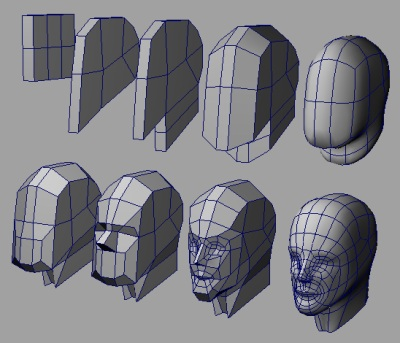
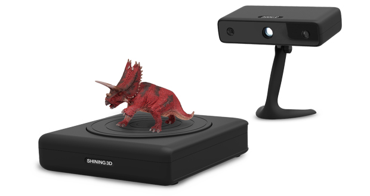
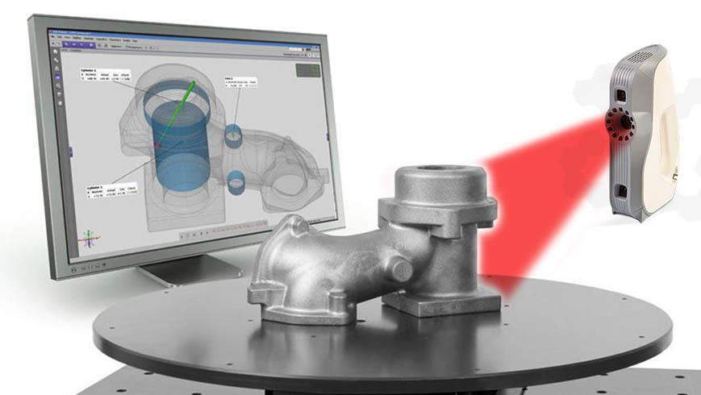
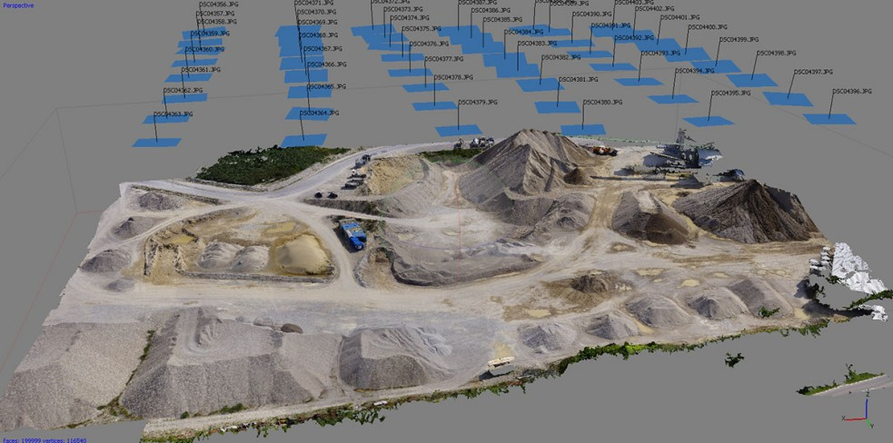
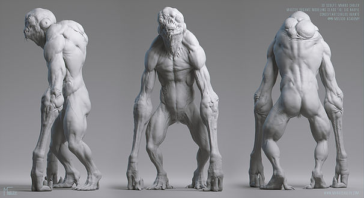

## 3D modelling
 <!-- .element width="40%" -->

Problem definition:
- How to create an stl file = input for Slicer
 
 

<i>Remember the chain: model (stl) -> slicer (g.code) -> Printer -> 3D Object</i>
---

## Modelling or Scanning?
 <!-- .element width="30%"-->
 <!-- .element width="45%" -->
----
## Scanning
 <!-- .element width="40%" -->
----
## Photogrammetry
 <!-- .element width="40%" -->
 

<b>WorkFlow Example:</b> Multiple Pictures -> PointCloud -> Mesh -> Model Optimization -> Slicer -> 3D Printer -> 3D Object
----
## Photogrammetry in practice
 <!-- .element width="40%" -->
 <!-- .element width="40%" -->
----
## Available Tools
<b>Paid</b>: e.g. Agisoft Photoscan 
(www.agisoft.com)

<b>OR</b>
 
<b>Free:</b> e.g. COLMAP together with OpenMVS 
(colmap.github.io, cdcseacave.github.io/openMVS)
---

## Organic or Engineering?
 <!-- .element width="45%" .element height="200%"-->
 <!-- .element width="50%" -->
